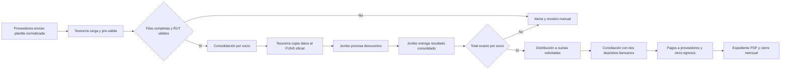
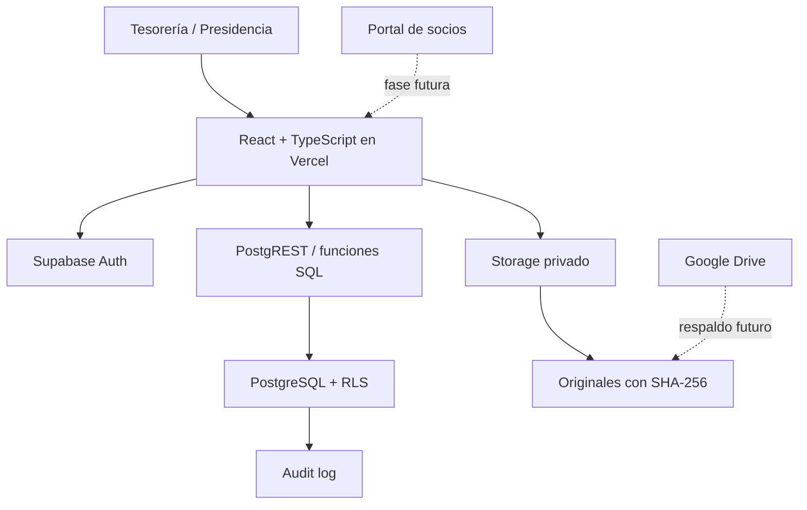

# Documentación maestra — Control sindical

> Documento de traspaso funcional, contable y técnico.  
> Proyecto: Contabilidad del Sindicato Empresa Jumbo Administradora Norte de Copiapó.  
> Estado de referencia: 31 de julio de 2026.  
> Versión del documento: 1.0.

## Índice

1. Propósito del documento
2. Resumen ejecutivo
3. Identidad, alcance y actores
4. Reglas del negocio confirmadas
5. Preguntas y respuestas consolidadas
6. Fuentes documentales analizadas
7. Plantilla normalizada para proveedores
8. Flujo mensual objetivo
9. Arquitectura técnica
10. Módulos implementados
11. Datos reales y correcciones
12. Migraciones y base de datos
13. Seguridad
14. Protección de datos y Ley 21.719
15. PWA y offline
16. Google Drive
17. Diseño y experiencia de usuario
18. Calidad y pruebas
19. Historial de implementación
20. Scrum
21. Product backlog
22. Historias de usuario
23. Riesgos
24. FODA
25. Decisiones de arquitectura
26. Incorporación de colaboradores
27. Convenciones
28. Problemas y aprendizajes
29. Límites actuales
30. Próxima meta
31. Fuentes

## 1. Propósito de este documento

Este archivo concentra el conocimiento reunido durante el descubrimiento, diseño,
implementación y despliegue inicial del sistema. Debe servir para:

- incorporar nuevos desarrolladores, asesores contables o integrantes de la directiva;
- evitar que las reglas del sindicato se pierdan o se simplifiquen incorrectamente;
- distinguir lo implementado de lo planificado;
- respaldar decisiones de arquitectura, seguridad y protección de datos;
- ordenar el backlog y las siguientes iteraciones bajo una metodología Scrum práctica;
- entregar una base para pruebas, auditorías, continuidad operacional y mantenimiento.

Este documento **no reemplaza** los estatutos, convenios firmados, contratos bancarios,
asesoría contable ni asesoría jurídica. Cuando exista contradicción, debe prevalecer el
documento formal correspondiente y actualizarse este archivo.

## 2. Resumen ejecutivo

Control sindical es una aplicación web responsive para administrar la contabilidad y
los convenios de un solo sindicato. Su objetivo inmediato es facilitar el trabajo de
tesorería mediante:

- carga segura de archivos mensuales;
- conservación del original y su huella SHA-256;
- prevalidación de planillas sin contabilización automática;
- revisión por RUT, nombre, tipo y estado;
- conciliación entre proveedor, FUNS, resultado de Jumbo y cartola bancaria;
- cuenta individual tipo banco para cada socio;
- trazabilidad de descuentos, pagos, cuotas y deuda respaldada;
- separación entre quien prepara y quien aprueba una operación.

La prioridad acordada es la contabilidad. El portal del socio, las funciones de
secretaría, certificados, OCR y notificaciones avanzadas se realizarán después de que
el circuito contable sea estable.

### Estado resumido

| Área | Estado | Observación |
|---|---|---|
| Diseño responsive | Implementado | Estética de vidrio, profundidad y referencias visuales de iOS 26 |
| Icono de la aplicación | Implementado | Variantes 192, 512, 1024 y Apple Touch Icon |
| Autenticación | Implementada | Magic link de Supabase para usuarios creados previamente |
| Autorización tesorería/presidencia | Implementada en base y frontend | Actualmente existe una cuenta operativa de tesorería; falta crear presidencia |
| Base contable | Implementada | PostgreSQL/Supabase, migraciones versionadas, RLS y auditoría |
| Cargas mensuales | Implementada | XLSX/CSV interpretables; XLS/PDF se archivan |
| Revisión de filas | Implementada | Búsqueda por RUT/nombre, filtros y paginación |
| Padrón inicial | Implementado | Se construyó desde la hoja autoritativa de cuota social de $8.000 |
| Padrón mensual | Implementado | Vista previa y confirmación antes de altas, reactivaciones o inactivaciones |
| Cuenta individual del socio | Implementada | Historial, cuota social y convenio consolidado |
| Inicio operativo | Implementado | Consulta Supabase; no contiene cifras ni actividad demostrativas |
| Conciliación mensual | Implementada parcialmente | Muestra datos reales y bloqueadores; falta FUNS/proveedores/cartola interpretados |
| Convenios y cuotas canónicas | Esquema listo, interfaz pendiente | La deuda no se inventa desde el total consolidado |
| Ingresos y egresos | Esquema listo, interfaz pendiente | Se muestra estado vacío explícito, sin datos demostrativos |
| Pagos a proveedores | Esquema listo, interfaz pendiente | Incluye aprobación separada en base de datos |
| Cierre mensual y PDF | Esquema listo, interfaz pendiente | Falta generar expediente y acta imprimible |
| Google Drive | No implementado | No se muestra un respaldo ficticio en la interfaz |
| Trabajo offline | No implementado | Existe manifiesto web, pero no service worker ni caché offline |
| Portal de socios | Postergado | Se abordará después del circuito contable |
| Secretaría y altas | Postergado | Reglas definidas, interfaz pendiente |
| Certificados | Postergado | Antigüedad/vigencia, firma imagen y folio verificable pendientes |
| OCR de boletas | Postergado | Debe ser editable y revisado por una persona |

## 3. Identidad, alcance y actores

### 3.1 Organización

- La aplicación administrará **un solo sindicato**.
- La configuración debe almacenar:
  - nombre legal del sindicato;
  - RUT del sindicato;
  - Registro Sindical Único (RSU);
  - fecha de inicio contable;
  - banco y cuenta bancaria sindical.
- La cuenta bancaria operativa es una única cuenta de **Scotiabank**.
- No existe caja chica: todo movimiento debe quedar respaldado por el banco.

### 3.2 Roles acordados

| Rol | Facultades esperadas | Estado actual |
|---|---|---|
| Tesorero | Crear, cargar, corregir antes de confirmar, proponer pagos y excepciones | Acceso implementado |
| Presidente | Consultar y aprobar operaciones propuestas por tesorería | Modelo implementado; cuenta separada pendiente |
| Secretario | Consultar y autorizar incorporación de socios | Futuro |
| Comisión revisora | Recibe expediente generado; tres integrantes revisan y firman manuscritamente | Futuro; no requiere cuentas personales inicialmente |
| Socio | Consultar solo sus datos y emitir certificados/resúmenes | Futuro |

- Presidente y tesorero ejercen cargos de cuatro años.
- Debe conservarse el historial de quién ocupó cada cargo y durante qué fechas.
- El cambio de directiva no debe alterar ni borrar las operaciones de periodos anteriores.

### 3.3 Separación de funciones

- Tesorería prepara la operación.
- Presidencia aprueba.
- Una misma persona no puede crear y aprobar la misma operación.
- Para transferencias, tesorería prepara en el banco y presidencia aprueba con Digipass.
- Los cheques deben ser firmados por presidente y tesorero.
- La aplicación registra el flujo administrativo, pero no reemplaza las medidas de
  seguridad ni la autorización del banco.

## 4. Reglas del negocio confirmadas

### 4.1 Periodo contable y marcha blanca

- El sistema comienza desde cero en **julio de 2026**.
- Debe registrarse como apertura el saldo real de Scotiabank al **30 de junio de 2026**.
- Julio y agosto de 2026 constituyen una marcha blanca de dos meses.
- Durante la marcha blanca se cargarán planillas heredadas, se cruzarán manualmente
  las diferencias y se perfeccionarán las reglas.
- Desde el tercer mes se espera que los proveedores usen la plantilla normalizada.
- Los cuatro años anteriores ya fueron revisados y cerrados. No se importarán como
  transacciones; sus archivos pueden conservarse fuera del sistema como archivo histórico.

### 4.2 Calendario operativo mensual

| Hito | Regla |
|---|---|
| Recepción ideal de planillas de convenios | Hasta el día 7 del mes |
| Límite absoluto para incluir en FUNS | Día 9 a las 12:00 |
| Envío a Jumbo | Mediante la plantilla FUNS oficial e inalterable |
| Resultado de Jumbo | Primeros cinco días del mes siguiente |
| Depósitos de Jumbo | Antes del día 5 del mes siguiente |
| Pago normal a proveedores | Entre los días 10 y 15 |
| Ejemplo confirmado | Lo enviado hasta el 9 de agosto se recauda antes del 5 de septiembre |

Cada ciclo mantiene dos periodos distintos:

1. `discount_period`: mes en que se solicita/aplica el descuento por remuneración.
2. `collection_period`: mes siguiente, cuando el dinero ingresa a la cuenta sindical.

No deben mezclarse ambos conceptos en reportes ni conciliaciones.

### 4.3 Cuotas obligatorias

- Cuota social: **$8.000 mensuales por socio**.
- Cuota de federación: **$500 mensuales por socio**.
- Ambos descuentos aparecen separados en la liquidación.
- Los $500 de federación no ingresan a la cuenta del sindicato: la empresa los paga
  directamente a la federación.
- En caso de licencia médica, la empresa continúa pagando la cuota social y la cuota
  de federación; después regulariza con el trabajador cuando se reintegra.
- La planilla de $8.000 enviada por Jumbo se utiliza como fuente autoritativa del padrón
  de socios activos del periodo.

### 4.4 Devolución anual

- Por cada mes efectivamente cubierto se acumulan **$5.000** para devolución.
- Un año completo equivale a **$60.000**.
- Los meses de licencia se consideran porque la empresa mantiene el pago de la cuota.
- Un socio nuevo recibe el proporcional de meses pagados.
- Si la caja lo permite, la directiva puede aprobar un monto adicional común.
- El adicional se entrega también a socios nuevos, según la decisión de la directiva.
- La devolución de diciembre se genera masivamente.
- El sindicato transfiere directamente desde Scotiabank a las cuentas de los socios
  mediante una nómina bancaria masiva.
- La cuenta bancaria debe pertenecer al socio.
- Si el socio se retira antes de diciembre, recibe lo acumulado hasta ese momento.
- La compensación con deuda se aplica **solo por desvinculación o retiro**, no a la
  devolución ordinaria de diciembre.
- Si la deuda supera la devolución, el remanente conserva su tratamiento según el
  convenio y debe quedar registrado.

### 4.5 Convenios: definición general

Un convenio es un acuerdo entre el sindicato y un proveedor de servicios o productos,
por ejemplo cooperativa, clínica u óptica. El proveedor informa cuotas que se descuentan
al trabajador por remuneración. Jumbo devuelve solamente un total consolidado por socio;
no identifica dentro de ese total qué cuota pertenece a cada convenio.

Reglas transversales:

- el descuento siempre se registra a nombre del socio, aunque el beneficiario sea familiar;
- no se aplican intereses ni comisiones en los convenios actuales;
- un descuento es todo o nada, salvo error humano de omisión;
- cuando no se descuenta por licencia, la cuota se desplaza al mes siguiente y se extiende
  el plazo final;
- el sistema no puede distribuir una diferencia arbitrariamente;
- solo se distribuye automáticamente cuando el total informado por Jumbo coincide
  exactamente con las cuotas solicitadas para ese socio;
- cualquier diferencia se transforma en alerta de revisión manual;
- los proveedores deben usar una plantilla normalizada entregada por el sindicato;
- las excepciones las solicita el socio, tesorería las propone y presidencia las aprueba.

### 4.6 Reglas por proveedor

#### CAPUAL

- Tipo: cooperativa/préstamos.
- Monto máximo: sin tope definido por el sindicato.
- Familiares: no permitidos.
- Pago al proveedor: después del descuento efectivamente recibido.
- Licencia o desvinculación: CAPUAL persigue directamente a sus deudores.
- El sindicato no asume esa deuda después de la desvinculación.
- CAPUAL mantiene su propio orden y control de cuotas.

#### Clínica Rimo

- Tope general: **$500.000**, superable con autorización.
- Máximo normal: **6 cuotas**.
- Cuota objetivo: no superar **$50.000**.
- Tratamientos más costosos pueden dividirse en tramos sucesivos de seis cuotas.
- Si la cuota supera $50.000 o se requieren más cuotas, debe solicitarse autorización.
- Familiares: permitidos; el descuento siempre queda al socio.
- Pago al proveedor: en cuotas y antes de haber recaudado completamente del socio.
- Tras desvinculación, el sindicato debe seguir pagando según las reglas del convenio.

#### Óptica Joval

- Tope normal por ciclo: **$250.000**.
- Máximo normal: **3 cuotas**.
- El cupo no se recupera gradualmente: se libera al terminar la operación completa.
- Una nueva compra con deuda vigente requiere una excepción.
- El modelo permite varias operaciones, cuyos descuentos se suman para el FUNS; cuando
  exista deuda vigente, la nueva operación necesita la excepción indicada.
- Puede existir sobrecupo autorizado sin máximo absoluto actualmente definido.
- Familiares: permitidos; el descuento queda al socio.
- Pago al proveedor: después del descuento.
- Tras desvinculación, la deuda es asumida por el sindicato.
- Existen operaciones de óptica en tienda y operativos; el nombre del establecimiento
  solo será determinante cuando exista más de una óptica.
- Un archivo histórico utiliza el nombre Cirella. Mientras exista un solo convenio de
  óptica, no debe interpretarse automáticamente como un segundo proveedor distinto de
  Óptica Joval sin confirmación de tesorería.

### 4.7 Licencias, omisiones y desvinculaciones

- La empresa no descuenta convenios durante una licencia médica.
- La ausencia del descuento permite detectar la licencia; no existe por ahora un archivo
  formal de licencias.
- La cuota pendiente se desplaza al mes siguiente; no se acumula como doble cuota.
- El sindicato sigue pagando los convenios donde actúa como aval, salvo CAPUAL.
- Retiro voluntario y desvinculación laboral tienen el mismo efecto para el sindicato.
- La empresa genera un documento informando la salida; el socio debe darse de baja.
- Un exsocio no continúa como socio activo visible, pero la deuda asumida y su pago deben
  conservarse en el historial contable y de auditoría.
- Si la devolución acumulada no cubre la deuda de salida, el saldo restante debe quedar
  registrado según la responsabilidad definida para el proveedor.

### 4.8 Ingresos, egresos y pagos

- Jumbo realiza dos depósitos separados:
  1. cuota social;
  2. descuentos por convenios.
- La cuota de federación no pasa por la cuenta sindical.
- El sindicato paga siempre a los proveedores, con la excepción operacional de CAPUAL
  ya descrita.
- Todos los egresos se realizan por banco.
- Los egresos pueden incluir almuerzos, viajes, reuniones, arriendos, asesorías,
  celebraciones, ayudas, transporte, gastos legales u otros gastos de funcionamiento.
- El comprobante bancario acredita el pago al proveedor.
- Las fotografías de boletas y recibos se consideran respaldo documental.
- La lectura automática/OCR es futura y siempre deberá permitir revisión y corrección humana.

### 4.9 Cierre y revisión de cuentas

- La comisión revisora está integrada por tres socios.
- Los tres deben estar de acuerdo para cerrar el periodo.
- No necesitan inicialmente cuentas personales en la aplicación.
- Reciben un expediente PDF imprimible con cartolas, planillas, boletas, comprobantes,
  depósitos y pagos.
- El acta se firma manuscritamente, se digitaliza y se carga al sistema.
- La persona que carga el acta debe transcribir las observaciones o diferencias detectadas.
- La directiva explica o responde observaciones, pero la comisión realiza la revisión.

### 4.10 Incorporación y retiro de socios — alcance futuro

- La solicitud de ingreso requiere:
  - RUT;
  - nombres y apellidos;
  - correo;
  - teléfono;
  - banco;
  - tipo y número de cuenta propia.
- No se solicitarán número interno, área, sucursal, fecha de nacimiento ni domicilio.
- La fecha inicial propuesta por el sistema es la fecha actual.
- La fecha efectiva de ingreso es la fecha de autorización del secretario.
- Secretaría autoriza y la aplicación genera la solicitud a Jumbo con RUT, nombre y fecha.
- No se exige un formulario adjunto firmado en esta etapa.
- Un cambio de datos bancarios debe solicitarse; el socio no lo modifica directamente.

### 4.11 Portal del socio — alcance futuro

- El socio podrá ver solo sus propios datos, cobros, pagos, deudas y certificados.
- Podrá descargar certificados de antigüedad y socio vigente.
- Los certificados usarán firma incorporada como imagen y folio verificable.
- Al solicitar el certificado se confirmarán correo y teléfono para su envío.
- Los reclamos seguirán por los canales existentes; la aplicación prioriza consulta.
- RUT y nombre no son autenticación suficiente. Cuando se implemente, debe utilizarse un
  código temporal enviado a un medio previamente verificado.
- Impedir capturas de pantalla de forma absoluta no es posible en una aplicación web ni en
  todos los sistemas operativos. Solo pueden aplicarse mitigaciones de mejor esfuerzo, como
  ocultar datos al pasar a segundo plano, marcas de agua y restricciones nativas parciales.

## 5. Preguntas y respuestas consolidadas

Esta sección conserva las decisiones obtenidas durante el levantamiento.

### 5.1 Organización, usuarios y alcance

| Pregunta | Respuesta acordada |
|---|---|
| ¿Uno o varios sindicatos? | Uno; nombre, RUT y RSU configurables |
| ¿Quién modifica? | Presidente y tesorero, respetando separación de funciones |
| ¿Quién consulta? | Secretario; socios solo sus datos en una etapa futura |
| ¿Cuántos socios? | Aproximadamente 350; el padrón inicial real cargado contiene 370 |
| ¿Dispositivos? | PC, Mac, Android, iOS, tablet y navegador |
| ¿Quién trabaja offline? | Solo consultas; toda modificación debe requerir conexión |
| ¿Prioridad inmediata? | Contabilidad; portal de socio y secretaría después |

### 5.2 Contabilidad y banco

| Pregunta | Respuesta acordada |
|---|---|
| ¿Cómo se trabaja hoy? | Manualmente, con resúmenes bancarios y Excel impreso por mes |
| ¿Asientos formales o claridad? | Debe ser claro, auditable y respaldado; el modelo permite transacciones formales |
| ¿Caja chica? | No existe |
| ¿Varias cuentas? | Una cuenta Scotiabank |
| ¿Efectivo? | No; todo por banco |
| ¿Formatos del banco? | Excel, CSV o PDF, según convenga |
| ¿Saldo inicial? | Cartola y saldo real al 30 de junio de 2026 |
| ¿Histórico? | Inicio desde julio; ciclos anteriores permanecen fuera del sistema operativo |

### 5.3 Empresa Jumbo y conciliación

| Pregunta | Respuesta acordada |
|---|---|
| ¿Qué se envía a Jumbo? | FUNS oficial con RUT, nombre y monto consolidado |
| ¿Puede modificarse FUNS? | No; lo procesa un robot y cualquier cambio puede provocar rechazo |
| ¿Qué devuelve Jumbo? | Dos hojas: cuota social $8.000 y convenios consolidados |
| ¿Qué depósitos realiza? | Uno por cuota social y otro por convenios |
| ¿Entrega detalle por convenio? | No; solo total consolidado por socio |
| ¿Puede distribuir la app? | Solo si coincide exactamente; diferencias quedan para revisión manual |
| ¿Descuento parcial? | No, salvo error humano |
| ¿Cómo se detecta licencia? | Por la ausencia del descuento de convenio |

### 5.4 Proveedores

| Pregunta | Respuesta acordada |
|---|---|
| ¿Convenios actuales? | CAPUAL, Clínica Rimo y Óptica Joval |
| ¿Planilla común? | Sí; todos deberán usar la plantilla normalizada |
| ¿Nueva operación o cuota mensual? | La planilla debe identificar operación y cuota del mes |
| ¿Puede corregirse después del envío? | No |
| ¿Identificador actual? | Históricamente el archivo se identificaba por carpeta/mes; la aplicación agrega UUID, referencia y SHA-256 |
| ¿Documento tributario al sindicato? | No; los documentos tributarios van al socio |
| ¿Acreditación del pago? | Comprobante de transacción bancaria |

### 5.5 Devoluciones y retiros

| Pregunta | Respuesta acordada |
|---|---|
| ¿Se devuelve por nómina de remuneración? | No. Se aclaró que el sindicato transfiere por nómina bancaria masiva |
| ¿Monto base? | $5.000 por mes, hasta $60.000 por año completo |
| ¿Monto adicional? | Lo aprueba la directiva según caja disponible |
| ¿Retiro antes de diciembre? | Recibe lo acumulado |
| ¿Compensación con deuda? | Solo en desvinculación o retiro |
| ¿Cuenta bancaria de tercero? | No; debe pertenecer al socio |

## 6. Fuentes documentales analizadas

Los archivos originales se entregaron uno a uno para evitar confusión.

| Origen | Archivo | Uso |
|---|---|---|
| Jumbo | `SINDICATO EMPRESA JUMBO ADMINISTRADORA NORTE (COPIAPO)_281 (2).xlsx` | Resultado mensual: convenio consolidado y cuota social |
| CAPUAL | `264_266004_SIEMJUMBO_202607_20260603_122540_corregido.xls` | Planilla heredada CAPUAL; XLS archivado |
| Clínica Rimo | `descuento julio_corregido.xlsx` | Operaciones y cuotas heredadas |
| Óptica operativo | `JUMBO OPERATIVO OPTICA CIRELLA PAGO JULIO 2026.xlsx` | Operativo con pago diferido |
| Óptica tienda | `JUMBO PAGO JULIO 2026 COMPRAS EN OPTICA.xlsx` | Compras realizadas en tienda |
| Sindicato → Jumbo | `FUNS JUMBO Copiapo.xlsx` | Plantilla oficial inalterable procesada por robot |

Hallazgos técnicos relevantes:

- El resultado de Jumbo contiene las hojas `CESJUN`, `Hoja1` y `SIJUAN`.
- Las hojas presentan encabezados en filas diferentes.
- Las hojas `CESJUN` y `SIJUAN` incluyen al final una fórmula con el total completo.
- Esa fila de total no representa a un socio y duplicaba el monto si se interpretaba como
  descuento. Se agregó una corrección local y una migración de saneamiento.
- FUNS contiene fórmulas, validaciones y hojas auxiliares; no debe recrearse ni alterarse.
- La aplicación genera una planilla de preparación para que tesorería copie únicamente los
  datos requeridos por FUNS.

## 7. Plantilla normalizada para proveedores

Archivo generado:

`../outputs/plantilla_proveedor_convenios_v1.xlsx`

### 7.1 Hoja INSTRUCCIONES

Datos de proveedor y transferencia:

- razón social o nombre;
- RUT del proveedor;
- banco;
- tipo de cuenta;
- número de cuenta;
- titular de la cuenta;
- RUT del titular;
- correo de contacto.

### 7.2 Hoja CARGA MENSUAL

Campos de cabecera:

- proveedor;
- periodo de envío;
- preparado por;
- fecha de preparación.

Columnas por operación/cuota:

1. RUT socio.
2. Nombre completo socio.
3. Beneficiario: socio o familiar.
4. Nombre del beneficiario.
5. Fecha de operación.
6. Monto total.
7. Total de cuotas.
8. Mes de la primera cuota.
9. Número de cuota a descontar.
10. Monto de la cuota del mes.
11. Referencia del proveedor.
12. Observaciones.
13. Estado calculado.

La plantilla contiene 200 filas de entrada, listas controladas, validación de montos y
cuotas, formato de fechas, estado automático y protección de hoja. Solo las celdas
amarillas están desbloqueadas. Esto resuelve el error inicial donde toda la planilla había
quedado bloqueada.

La plantilla de proveedor **no reemplaza FUNS**. Es el insumo normalizado para que
tesorería prepare la información y copie RUT, nombre y monto a la estructura oficial.

## 8. Flujo mensual objetivo



Regla innegociable: una prevalidación correcta no crea por sí sola cuotas, deudas,
asientos ni pagos. La contabilización requiere completar las evidencias y controles del
flujo.

## 9. Arquitectura técnica

### 9.1 Stack activo

| Capa | Tecnología | Motivo |
|---|---|---|
| Lenguaje | TypeScript 5.7 | Tipado estático y contratos claros entre capas |
| Frontend | React 19 | Componentes funcionales, hooks y ecosistema actual |
| Compilación | Vite 8 | Desarrollo y build rápido para SPA |
| Backend gestionado | Supabase | PostgreSQL, Auth, Storage y API con plan gratuito inicial |
| Base de datos | PostgreSQL | Integridad referencial, transacciones, restricciones y auditoría |
| Autenticación | Supabase Auth | Enlaces temporales por correo y sesión gestionada |
| Autorización | PostgreSQL RLS | Permisos evaluados en la base, no solo en la interfaz |
| Archivos | Supabase Storage privado | Originales contables restringidos por rol |
| Hosting | Vercel | Despliegue automático desde GitHub |
| Repositorio | GitHub | Código y migraciones versionados |
| Iconos UI | Lucide React | Iconografía consistente y accesible |
| Lectura de XLSX | `read-excel-file` | Parser de solo lectura y carga diferida |
| Pruebas | Vitest | Pruebas unitarias de dominio, parser, integridad y feedback |
| Calidad | ESLint + TypeScript | Análisis estático y compilación estricta |

### 9.2 Servicios y repositorios

- Repositorio: <https://github.com/Antonioorellana/contabilidad_sindical>
- Producción: <https://contabilidad-sindical.vercel.app/>
- Rama productiva: `main`.
- Commit de referencia de esta documentación: `d879664`.
- Supabase: proyecto remoto Free en región `sa-east-1`.

No deben incluirse en este documento claves, tokens, contraseñas, códigos Digipass ni
valores de `service_role`.

### 9.3 Diagrama de componentes



### 9.4 Organización del frontend

- `src/features/auth`: autenticación y resolución del cargo activo.
- `src/features/monthly-imports`: carga, parser, integridad y revisión de filas.
- `src/features/reconciliation`: resumen y bloqueadores de conciliación.
- `src/features/member-accounts`: directorio y cuenta individual tipo banco.
- `src/domain`: funciones de dominio independientes de React.
- `src/lib`: configuración validada de Supabase y variables públicas.
- `src/styles.css`: sistema visual responsive.
- `public`: manifiesto e iconos de aplicación.

### 9.5 Modelo de datos principal

| Tabla | Responsabilidad |
|---|---|
| `profiles` | Perfil de usuario autorizado |
| `office_assignments` | Cargo y periodo de vigencia |
| `union_settings` | Identidad y configuración del sindicato |
| `members` | Padrón maestro de socios |
| `providers` | Convenios, reglas y datos bancarios |
| `monthly_cycles` | Periodo de descuento, recaudación y fechas límite |
| `source_files` | Evidencia original inmutable y hash |
| `import_batches` | Resultado de cada procesamiento |
| `staged_import_rows` | Filas temporales revisables |
| `agreement_operations` | Operación canónica de convenio por socio |
| `installments` | Calendario y estado de cada cuota |
| `payroll_requests` | Total solicitado por socio en un FUNS |
| `payroll_request_items` | Cuotas incluidas en la solicitud |
| `company_results` | Total consolidado informado por Jumbo |
| `reconciliations` | Cruce solicitado versus informado |
| `reconciliation_allocations` | Distribución respaldada a cuotas |
| `alerts` | Diferencias, ambigüedades y bloqueadores |
| `bank_movements` | Movimientos provenientes de cartola |
| `financial_categories` | Clasificación de ingresos y egresos |
| `financial_transactions` | Operaciones contables con aprobación |
| `provider_payments` | Pago aprobado a proveedor |
| `provider_payment_items` | Cuotas cubiertas por cada pago |
| `monthly_closures` | Cierre, saldos, revisores y acta |
| `audit_log` | Cambios de negocio con actor y fecha |

### 9.6 Estados relevantes

- Ciclo: borrador, enviado, esperando empresa, conciliando, revisión manual,
  listo para cerrar y cerrado.
- Operación: pendiente, activa, completada, anulada o asumida por sindicato.
- Cuota: programada, enviada, descontada, no descontada, pagada al proveedor,
  asumida por sindicato o anulada.
- Aprobación: borrador, pendiente, aprobada, rechazada, ejecutada o reversada.
- Importación: cargada, procesando, procesada, fallida o reemplazada.

## 10. Módulos implementados

### 10.1 Autenticación restringida

- No existe registro público.
- El enlace de acceso solo funciona para una cuenta creada previamente.
- El correo operativo configurado es `sindicato.jcopiapo@gmail.com`.
- Después de autenticar, la aplicación valida:
  1. sesión activa;
  2. perfil habilitado;
  3. cargo vigente de tesorería o presidencia.
- Un usuario de Supabase sin cargo no puede entrar a contabilidad.
- El enlace redirige al origen exacto de Vercel.
- Se corrigió una condición de bloqueo al ejecutar consultas dentro del callback de
  autenticación; la resolución de perfil se difiere hasta que Supabase termine de
  persistir la sesión.
- Supabase Free limita los correos de autenticación. La interfaz informa el límite
  temporal y evita interpretarlo como un error de contraseña.

### 10.2 Cargas mensuales

Tipos de documento:

- planilla de convenio;
- FUNS enviado;
- resultado empresa;
- cartola bancaria.

Controles:

- máximo 25 MB por archivo en el flujo mensual;
- máximo 5.000 filas por carga interpretable;
- extensiones admitidas: XLSX, CSV, XLS y PDF;
- XLS y PDF se archivan pero no se interpretan en esta etapa;
- el original se materializa localmente antes de operaciones asíncronas para evitar
  fallos de permisos con archivos provenientes de OneDrive/Finder;
- nombre sanitizado y ruta determinista;
- SHA-256 para detectar duplicados;
- colisiones recuperables de Storage tratadas de forma idempotente;
- originales registrados no pueden actualizarse ni eliminarse.

### 10.3 Parser de planillas

- Busca encabezados dentro de las primeras 25 filas.
- Reconoce aliases de RUT, nombre, monto, monto total, cuotas, periodo, categoría y
  referencia.
- Normaliza encabezados ignorando mayúsculas, tildes, guiones y espacios repetidos.
- Reconoce CSV separado por coma o punto y coma y respeta campos entre comillas.
- Solo acepta montos enteros no negativos en pesos.
- Clasifica cuota social y convenio según origen, categoría y monto.
- Elimina una fila final de total cuando contiene solo el monto y equivale a la suma
  de las filas precedentes.
- Mantiene filas ambiguas como `manual_review`.

### 10.4 Revisión de importación

- Permite escoger el archivo procesado.
- Busca por RUT o nombre con caracteres sanitizados.
- Filtra por estado y tipo de registro.
- Pagina resultados sin descargar todo el padrón al navegador.
- Muestra hoja, fila original, monto, cuota, estado y observaciones.
- No crea movimientos contables desde la revisión.

### 10.5 Cuenta individual del socio

- Directorio de hasta 60 resultados visibles con contador total exacto.
- Búsqueda con espera de 250 ms para reducir consultas.
- Consulta por RUT o nombre.
- Selección de una persona y carga bajo demanda de su cuenta.
- Muestra:
  - estado del socio;
  - movimientos respaldados;
  - cuota social pagada;
  - descuentos consolidados de convenios;
  - operaciones canónicas registradas;
  - deuda vencida respaldada;
  - cuotas futuras respaldadas;
  - cartola individual por periodo.
- Si todavía no existen operaciones/cuotas canónicas, muestra `Sin respaldo` en vez de
  asumir deuda cero o inventar una distribución.

### 10.6 Conciliación mensual

- Resume la cadena proveedor → FUNS → Jumbo → banco.
- Usa solo el archivo efectivo más reciente por fuente o proveedor.
- Los archivos reemplazados continúan auditables, pero no inflan el total.
- Compara totales y clasifica:
  - falta evidencia;
  - revisión manual;
  - coincidencia exacta;
  - diferencia;
  - solo referencia.
- Bloquea conciliación automática si:
  - falta FUNS;
  - falta resultado de Jumbo;
  - existen filas por revisar;
  - los montos difieren;
  - hay más de un archivo activo para una fuente única.

### 10.7 Inicio operativo y mantenimiento del padrón

- Inicio consulta socios activos, totales informados, observaciones y fuentes reales.
- Si falta una fuente, muestra `Sin datos` o `Sin cargar`; no reemplaza la ausencia con cero.
- Los módulos aún no construidos muestran un estado pendiente y nunca reutilizan el
  dashboard como si fueran funcionales.
- Tesorería puede previsualizar una actualización del padrón desde el resultado Jumbo.
- La vista previa informa nuevos, reactivados, nombres actualizados e inactivos.
- La aplicación exige confirmar exactamente las inactivaciones calculadas y rechaza una
  nómina inferior al 80 % del padrón activo para evitar bajas masivas accidentales.
- Una carga errónea puede marcarse `superseded` con motivo obligatorio. El original no
  se elimina ni se altera y la acción queda en auditoría.

## 11. Datos reales cargados y correcciones realizadas

Snapshot validado en producción al 31 de julio de 2026:

| Métrica | Valor |
|---|---:|
| Socios activos | 370 |
| Filas válidas del resultado Jumbo | 537 |
| Filas en revisión | 0 |
| Socios vinculados | 370 |
| Cuota social informada | $2.960.000 |
| Convenios informados | $11.137.265 |
| Total informado | $14.097.265 |
| Estado del ciclo | Conciliando |

Correcciones aplicadas:

1. Se identificaron dos filas finales de total que duplicaban los importes de sus hojas.
2. Se eliminó su interpretación como movimientos de socios.
3. La carga bajó de 539 a 537 filas reales.
4. La hoja de cuota social de $8.000 creó el padrón inicial de 370 socios.
5. Las filas se asociaron por RUT normalizado.
6. Las alertas `member_not_found` se resolvieron cuando el RUT quedó vinculado.
7. La nómina real de 370 socios puede aplicarse mensualmente mediante un flujo auditable.

Pendientes sobre los datos:

- cargar e interpretar FUNS;
- cargar las planillas normalizadas de proveedores;
- definir cuál archivo duplicado de resultado empresa queda reemplazado;
- cargar la cartola bancaria interpretable;
- registrar el saldo real de apertura;
- crear operaciones y cuotas canónicas antes de calcular deuda detallada.

## 12. Migraciones y estado de base de datos

Migraciones del repositorio:

1. `202607290001_initial_accounting.sql`: esquema contable, roles, RLS, auditoría,
   Storage y aprobaciones.
2. `202607290002_lock_down_auto_rls.sql`: revoca ejecución insegura de la función de
   auto-RLS creada por Supabase.
3. `202607290003_monthly_imports.sql`: staging, registro seguro e ingesta mensual.
4. `202607300001_fix_import_error_summary.sql`: corrige ambigüedad de nombre en PL/pgSQL.
5. `202607300002_remove_amount_only_sheet_totals.sql`: elimina totales repetidos.
6. `202607300003_bootstrap_member_ledger.sql`: crea padrón inicial y vincula filas.
7. `202607310001_live_roster_and_import_management.sql`: agrega actualización
   mensual del padrón, vista previa, descarte auditable y protección contra bajas masivas.

Las siete fueron ejecutadas manualmente en SQL Editor. Antes de utilizar por primera vez
`supabase db push`, debe enlazarse el CLI y marcarse cada versión como aplicada. De lo
contrario, el CLI intentará repetir cambios ya presentes.

```bash
supabase link --project-ref PROJECT_REF
supabase migration repair 202607290001 --status applied
supabase migration repair 202607290002 --status applied
supabase migration repair 202607290003 --status applied
supabase migration repair 202607300001 --status applied
supabase migration repair 202607300002 --status applied
supabase migration repair 202607300003 --status applied
supabase migration repair 202607310001 --status applied
```

`PROJECT_REF` no debe publicarse innecesariamente y las claves nunca deben incorporarse
al repositorio.

## 13. Seguridad implementada

### 13.1 Identidad y acceso

- Registro público deshabilitado desde el flujo de la aplicación.
- Magic link de un solo uso y vencimiento temporal.
- Validación de cargo vigente después de autenticar.
- RLS en todas las tablas.
- Privilegio mínimo por rol.
- La clave `service_role` nunca se usa en React.
- Las variables reales se configuran en `.env.local` y Vercel; solo existe
  `.env.example` en Git.

### 13.2 Integridad financiera

- RUT chileno normalizado y validado con módulo 11.
- Claves foráneas y restricciones en PostgreSQL.
- Montos enteros en CLP, evitando redondeos de punto flotante.
- Separación entre creador y aprobador.
- Bloqueo de conciliación ante diferencias.
- Operaciones confirmadas no deben eliminarse: se reversan o ajustan con trazabilidad.
- Cierres requieren tres revisores y acta.

### 13.3 Archivos y evidencia

- Bucket `accounting-private` no público.
- Original registrado inmutable.
- SHA-256, tamaño, tipo, usuario y fecha de carga.
- Eliminación solo de objetos todavía no registrados y pertenecientes al tesorero actual.
- MIME types restringidos.
- La app no interpreta XLS/PDF de forma insegura durante la marcha blanca.

### 13.4 Auditoría

- Triggers automáticos sobre tablas críticas.
- Registra actor, operación, columnas modificadas, estado anterior y nuevo.
- Excluye del detalle de auditoría campos personales como RUT, nombre y cuenta bancaria,
  reduciendo duplicación innecesaria de datos sensibles.
- La tabla de auditoría es de solo lectura para usuarios de la aplicación.

### 13.5 Controles todavía pendientes

- segunda cuenta real de presidencia y prueba completa de doble aprobación;
- política de copias de seguridad y restauración probada;
- integración institucional con Google Drive;
- MFA adicional si Supabase/plan elegido lo permite;
- monitoreo y alertas de seguridad;
- política formal de conservación y eliminación;
- procedimiento de respuesta a incidentes;
- revisión periódica de dependencias;
- prueba de recuperación ante pérdida del proveedor o cuenta administradora.

## 14. Protección de datos personales y Ley 21.719

La Ley 21.719 fue publicada el 13 de diciembre de 2024 y entra en vigencia el
**1 de diciembre de 2026**. El diseño debe estar preparado antes del lanzamiento completo,
no corregirse después. Fuente oficial: [Biblioteca del Congreso Nacional — Ley
21.719](https://www.bcn.cl/leychile/navegar?i=1209272).

### 14.1 Datos tratados

- RUT y nombre de socios.
- Estado de afiliación.
- Correo y teléfono futuros.
- Datos bancarios futuros.
- Descuentos, cuotas, deudas y pagos.
- Información que puede revelar indirectamente licencias médicas.
- Identidad de directivos y actores de operaciones.
- Archivos y comprobantes financieros.

Los datos financieros y cualquier inferencia de salud requieren controles reforzados.
La aplicación no debe mostrar ni almacenar un diagnóstico médico; solo el estado operativo
estrictamente necesario para explicar que una cuota no fue descontada.

### 14.2 Principios aplicados

- **Finalidad:** cada dato debe existir para afiliación, descuento, pago, contabilidad,
  auditoría o comunicación definida.
- **Minimización:** no se recopilan domicilio, fecha de nacimiento, sucursal ni número
  interno porque no son necesarios actualmente.
- **Proporcionalidad:** la pantalla carga solo la cuenta seleccionada y no toda la historia
  de todos los socios.
- **Seguridad:** cifrado en tránsito, controles del proveedor en reposo, RLS y Storage privado.
- **Confidencialidad:** acceso restringido por cargo.
- **Exactitud:** RUT validado y correcciones manuales trazables.
- **Retención limitada:** nombres temporales de staging tienen retención prevista de 90 días.
- **Responsabilidad demostrable:** migraciones, auditoría, pruebas y decisiones documentadas.

### 14.3 Derechos de los titulares

La arquitectura futura debe permitir acceso, rectificación, supresión cuando corresponda,
oposición, portabilidad y bloqueo. No basta con una declaración en la política de
privacidad: deben existir procesos o servicios para:

- exportar datos personales en JSON/CSV;
- recibir y autenticar solicitudes;
- rectificar datos maestros sin alterar evidencia contable histórica;
- bloquear o seudonimizar datos cuando la conservación contable impida borrarlos;
- registrar solicitud, decisión, fundamento, responsable y fecha.

### 14.4 Pendientes normativos obligatorios antes del uso completo

1. Identificar formalmente al responsable del tratamiento.
2. Documentar finalidad y base de licitud de cada categoría de datos.
3. Publicar política de privacidad y canales de contacto.
4. Definir plazos de conservación por categoría.
5. Implementar proceso ARCO+, portabilidad y bloqueo.
6. Preparar evaluación de impacto si el alcance llega a monitoreo sistemático o tratamiento
   masivo de información financiera/sensible.
7. Formalizar contratos de encargado con Supabase, Vercel, Google y correo.
8. Revisar transferencias internacionales, ya que Supabase está en Brasil y otros servicios
   pueden operar fuera de Chile.
9. Crear plan de respuesta y notificación de brechas.
10. Definir eliminación segura al terminar una cuenta o proveedor, respetando obligaciones
    contables y de auditoría.

Usar un Google Drive personal pagado es técnicamente posible, pero no es una solución de
gobierno adecuada por sí sola: concentra continuidad, acceso y propiedad en una persona.
La alternativa correcta es una cuenta institucional del sindicato, acceso delegado,
registro de responsables, MFA y procedimiento de transferencia de administración.

## 15. Disponibilidad, PWA y trabajo offline

### Implementado

- interfaz responsive para escritorio, tablet y móvil;
- `manifest.webmanifest`;
- iconos para instalación y pantalla de inicio;
- diseño compatible con navegador moderno.

### No implementado todavía

- service worker;
- caché de interfaz;
- IndexedDB para consultas locales;
- sincronización segura al recuperar conexión;
- expiración y borrado remoto de datos offline;
- control de acceso local después de cerrar sesión.

Por tanto, la aplicación **no debe presentarse todavía como operativa offline**. Cuando se
implemente, solo se almacenarán vistas de consulta mínimas y cifradas o protegidas por el
dispositivo. Las modificaciones, aprobaciones, reversos y cargas continuarán exigiendo
conexión y una transacción autenticada contra Supabase.

## 16. Estrategia de Google Drive

Uso previsto:

- segunda copia cifrada de originales y expedientes cerrados;
- organización por año, periodo y tipo documental;
- recuperación ante pérdida o suspensión de Supabase;
- no utilizar Drive como base de datos transaccional.

Flujo futuro recomendado:

1. Cerrar o confirmar un documento en Supabase.
2. Generar una copia cifrada o un paquete de respaldo.
3. Enviar mediante Drive API desde backend seguro, nunca desde secretos expuestos en React.
4. Guardar ID de Drive, hash, versión, fecha y resultado del respaldo.
5. Probar restauración periódicamente.

La interfaz no afirma que exista un respaldo Drive. El estado real deberá mostrarse
solamente cuando la integración exista y confirme una copia verificable.

## 17. Criterios de diseño y experiencia de usuario

- Referencia visual: superficies translúcidas, profundidad, brillos suaves, bordes
  redondeados y jerarquía inspirada en iOS 26.
- No se replica literalmente la interfaz de Apple ni se depende de sus recursos.
- Diseño tipo banca para que tesorería vea una cuenta completa por persona.
- Colores semánticos:
  - azul: información/acción principal;
  - turquesa: correcto o respaldado;
  - ámbar: revisión;
  - rojo/rosa: diferencia crítica.
- Las cifras financieras usan CLP sin decimales.
- Los estados no dependen solo del color: siempre incluyen texto.
- `⌘ K` o `Ctrl K` lleva a búsqueda de socios.
- Las pantallas pesadas cargan datos bajo demanda y con límites.
- Nunca se muestra una deuda como cero si faltan los documentos necesarios.

Se utilizó un prototipo de Stitch como referencia inicial. La implementación final se
reescribió en React y CSS del proyecto para evitar una dependencia de Tailwind/CDN y para
mantener control del diseño, rendimiento y seguridad.

## 18. Calidad y pruebas

Comandos obligatorios antes de publicar:

```bash
npm run lint
npm test
npm run build
git diff --check
```

Última verificación completa:

- 7 archivos de prueba;
- 33 pruebas aprobadas;
- ESLint aprobado;
- TypeScript aprobado;
- build Vite aprobado;
- despliegue Vercel `READY`;
- cero errores/fatales encontrados en los logs de producción durante la verificación;
- prueba real en navegador de autenticación, padrón, búsqueda por RUT, cuenta individual
  y conciliación.

Cobertura funcional de pruebas existente:

- conciliación exacta y diferencias;
- integridad y nombres de archivos;
- feedback de autenticación;
- parser XLSX/CSV y eliminación de totales finales;
- búsqueda segura;
- cálculo de cuenta individual sin deuda inferida;
- selección de fuentes efectivas para conciliación.

Pruebas pendientes:

- end-to-end automatizado del flujo completo;
- RLS por cada rol y tabla;
- aprobación tesorero → presidente;
- cargas con archivos grandes y corruptos;
- recuperación de respaldo;
- accesibilidad WCAG;
- dispositivos móviles reales;
- condiciones de red lenta o intermitente.

## 19. Historial de implementación

### Etapa 1 — Descubrimiento

- levantamiento de flujo contable, cuotas, convenios, licencias, devoluciones y cierres;
- definición del inicio julio de 2026;
- decisión de marcha blanca de dos meses;
- prioridad contable sobre portal de socios.

### Etapa 2 — Ingeniería inversa de planillas

- análisis hoja por hoja de Jumbo, CAPUAL, Rimo, óptica y FUNS;
- detección de encabezados variables, fórmulas y filas finales de total;
- creación y corrección de plantilla estándar de proveedores.

### Etapa 3 — Diseño del producto

- prototipo tipo dashboard;
- lenguaje visual inspirado en iOS 26;
- icono propio;
- estructura de navegación y responsive design.

### Etapa 4 — Base segura

- Supabase/PostgreSQL;
- tablas, estados, restricciones y funciones;
- RLS, Storage privado y auditoría;
- separación tesorero/presidente;
- despliegue en Vercel y repositorio GitHub.

### Etapa 5 — Autenticación y cargas

- acceso por correo autorizado;
- corrección del callback de autenticación;
- manejo de límite temporal de correos;
- carga durable, hash, archivo privado, parser y staging;
- reparación de errores por colisión y ambigüedad SQL.

### Etapa 6 — Datos operativos

- revisión de filas con búsqueda;
- eliminación de dos filas de total repetido;
- bootstrap de 370 socios;
- vinculación de 537 movimientos;
- pantalla de cuenta individual;
- conciliación mensual real;
- publicación en producción.

## 20. Scrum adaptado al proyecto

### 20.1 Visión del producto

Permitir que tesorería administre un ciclo contable mensual completo, auditable y fácil
de revisar, reduciendo planillas manuales, errores de distribución y tiempo invertido en
buscar la situación de cada socio.

### 20.2 Roles Scrum sugeridos

| Rol Scrum | Responsable sugerido |
|---|---|
| Product Owner | Tesorero, con validación de la directiva |
| Stakeholder aprobador | Presidente |
| Expertos de dominio | Tesorero, contador y comisión revisora |
| Scrum Master | Responsable técnico o coordinador designado |
| Equipo de desarrollo | Desarrollo frontend, backend/datos, QA y seguridad |

La comisión revisora no debe actuar como Product Owner: su independencia para revisar
debe conservarse.

### 20.3 Cadencia recomendada

- Sprint de dos semanas.
- Refinamiento semanal de 45 minutos.
- Planificación al inicio del sprint.
- Revisión con datos de prueba o periodo real al final.
- Retrospectiva breve y registro de acciones.
- Publicación solo después de criterios de aceptación y Definition of Done.

### 20.4 Definition of Ready

Una historia entra a sprint cuando:

- la regla contable está confirmada;
- existe ejemplo real y contraejemplo;
- se conoce la fuente de datos;
- se define quién crea, consulta y aprueba;
- se identifican datos personales y finalidad;
- se define comportamiento ante error y ausencia de información;
- existen criterios de aceptación verificables.

### 20.5 Definition of Done

Una historia está terminada cuando:

- frontend, servicio y base usan un contrato coherente;
- RLS y validaciones del servidor protegen la operación;
- existen pruebas unitarias y/o integración proporcionales al riesgo;
- `lint`, tests, build y `git diff --check` pasan;
- no se exponen secretos ni datos innecesarios;
- estados de carga/error/vacío son comprensibles;
- se prueba en producción o preview con datos autorizados;
- migración y documentación quedan versionadas;
- existe trazabilidad o reverso para las operaciones financieras.

### 20.6 Sprints ejecutados de forma retrospectiva

| Sprint/etapa | Incremento |
|---|---|
| Descubrimiento | Reglas, roles, calendario, convenios y alcance |
| Prototipo | Dashboard, icono y plantilla de proveedores |
| Plataforma | React, Supabase, RLS, Storage y Vercel |
| Acceso y cargas | Magic link, ciclos, archivos, hash y staging |
| Revisión | Búsqueda, filtros, parser y correcciones de datos |
| Cuenta y conciliación | Padrón, historial individual y cruces reales |

## 21. Product backlog priorizado

### P0 — Integridad y operación básica

1. Reparar historial de migraciones de Supabase CLI.
2. Marcar como `superseded` el resultado de Jumbo que corresponda, conservando evidencia.
3. Cargar e interpretar FUNS.
4. Cargar planillas de CAPUAL, Rimo y Joval con transición controlada desde formatos antiguos.
5. Cargar y reconciliar cartola bancaria.
6. Registrar saldo real de apertura.
7. Crear cuenta separada de presidencia y probar doble aprobación.

### P1 — Convenios, cuotas y deuda

1. CRUD de proveedores y reglas versionadas.
2. Importación a `agreement_operations` e `installments` después de aprobación.
3. Consolidación por socio para preparar FUNS.
4. Distribución automática solo por coincidencia exacta.
5. Resolución manual de diferencias con actor, motivo y evidencia.
6. Alertas de licencia/no descuento y desplazamiento de cuota.
7. Excepciones tesorero → presidente.
8. Responsabilidad de deuda al desvincularse.
9. Pagos a proveedores según antes/después de recaudación.

### P2 — Contabilidad y cierre

1. Importador de cartola CSV/XLSX.
2. Ingresos y egresos asociados a movimiento bancario.
3. Categorías contables administrables.
4. Adjuntos de boletas, recibos y comprobantes.
5. Expediente mensual PDF.
6. Acta de tres revisores y observaciones.
7. Cierre irreversible con reversos posteriores controlados.
8. Nómina masiva de devolución anual y compensación de retiros.

### P3 — Continuidad, privacidad y experiencia

1. Respaldo institucional en Google Drive.
2. Exportación ARCO+/portabilidad.
3. Política de privacidad y retención.
4. Portal del socio con OTP.
5. Secretaría, altas, bajas y cambios bancarios.
6. Certificados con folio verificable.
7. Notificaciones por correo.
8. Consulta offline mínima y segura.
9. OCR asistido y revisable.

## 22. Historias de usuario principales

### HU-01 — Consultar cuenta individual

Como tesorero, quiero buscar un socio por RUT o nombre para conocer sus descuentos,
pagos y deuda respaldada sin revisar múltiples planillas.

Criterios:

- una búsqueda parcial devuelve coincidencias;
- el socio seleccionado muestra cuota social y convenios descontados;
- deuda y cuotas futuras solo aparecen si existen operaciones canónicas;
- faltas de evidencia se explican, no se muestran como cero.

### HU-02 — Cargar resultado de Jumbo

Como tesorero, quiero conservar y prevalidar la planilla para usarla como evidencia sin
crear registros contables erróneos.

Criterios:

- original privado e inmutable;
- hash SHA-256;
- filas de total no se contabilizan como socios;
- RUT y monto se validan;
- filas ambiguas generan alerta.

### HU-03 — Conciliar descuentos

Como tesorero, quiero comparar lo solicitado y lo informado para distribuir cuotas solo
cuando exista coincidencia exacta.

Criterios:

- diferencia distinta de cero bloquea la distribución;
- el sistema no decide prioridades arbitrarias;
- tesorería puede investigar y resolver dejando motivo;
- la fuente y fila original permanecen visibles.

### HU-04 — Aprobar pago

Como presidente, quiero aprobar o rechazar un pago preparado por tesorería para mantener
separación de funciones.

Criterios:

- el creador no puede aprobar;
- solo presidencia vigente aprueba;
- se registra fecha, actor y nota;
- la ejecución exige respaldo bancario.

### HU-05 — Cerrar el mes

Como comisión revisora, quiero recibir un expediente completo para validar que los
movimientos coinciden con banco y comprobantes.

Criterios:

- PDF imprimible;
- saldos de apertura y cierre;
- ingresos, egresos, depósitos y pagos;
- tres nombres de revisores;
- acta firmada y observaciones cargadas;
- el ciclo no cierra si falta evidencia.

## 23. Matriz de riesgos

| Riesgo | Impacto | Probabilidad | Mitigación |
|---|---|---|---|
| Distribución incorrecta de total consolidado | Crítico | Alta sin FUNS | Coincidencia exacta y revisión manual |
| Pérdida de originales | Crítico | Media | Storage privado, hash y respaldo externo |
| Cuenta única para tesorero/presidente | Alto | Actual | Crear usuarios separados antes de aprobar operaciones |
| Formato de proveedor cambia | Alto | Alta en marcha blanca | Plantilla estándar, parser versionado y staging |
| Límites de Supabase Free | Medio/alto | Media | Monitorear cuotas y escalar cuando el uso lo justifique |
| Límite de correo Auth | Medio | Ya observado | Evitar reenvíos, SMTP propio o plan superior futuro |
| Uso de Drive personal | Alto | Media | Migrar a cuenta institucional con MFA y delegación |
| Acceso indebido a datos de socios | Crítico | Media | RLS, rol, auditoría, mínimo privilegio y revisión |
| Inferencia de salud por licencias | Alto | Media | No almacenar diagnósticos; limitar estado y acceso |
| Migraciones manuales desalineadas | Alto | Alta | Reparar historial CLI y automatizar CI/CD |
| Interfaz muestra cifras demo como reales | Alto | Resuelto | Inicio consulta Supabase y módulos pendientes muestran estado vacío |
| Dependencia de una sola persona | Alto | Alta | Documentación, cuentas delegadas, runbook y capacitación |

## 24. Análisis FODA

### Fortalezas

- Reglas de negocio levantadas con alto nivel de detalle.
- Arquitectura transaccional con PostgreSQL y restricciones reales.
- Seguridad en la base mediante RLS, no solo controles visuales.
- Evidencia original inmutable y con huella de integridad.
- Separación de funciones incorporada al modelo.
- Carga y revisión de datos reales ya operativas.
- Cuenta individual clara para el trabajo diario del tesorero.
- Enfoque conservador: no inventa deudas ni distribuciones.
- Stack moderno, conocido y con bajo costo inicial.
- Pruebas automatizadas y despliegue continuo.

### Oportunidades

- Estandarizar la relación con todos los proveedores.
- Reducir horas de revisión manual y errores en FUNS.
- Construir un historial financiero confiable por socio.
- Automatizar devoluciones, pagos y expedientes de cierre.
- Mejorar transparencia ante directiva, comisión y socios.
- Incorporar certificados y autoservicio sin exponer datos de terceros.
- Generar indicadores de morosidad, flujo de caja y compromisos futuros.
- Convertir el proceso en un modelo reutilizable para otros sindicatos en el futuro,
  sin alterar el alcance actual de un solo sindicato.

### Debilidades

- Solo parte del menú está conectada a datos reales.
- No existe todavía deuda canónica por convenio.
- FUNS, proveedores y banco aún no completan la cadena automatizada.
- Historial de migraciones del CLI está pendiente de reparación.
- Dependencia actual de una sola cuenta/persona operativa.
- Planes gratuitos imponen límites de correo, capacidad y soporte.
- Sin respaldo Drive real ni prueba de restauración.
- Sin operación offline efectiva.
- Sin política formal de privacidad, retención ni derechos ARCO+.
- Formatos heredados todavía requieren intervención manual.

### Amenazas

- Brecha de datos personales o financieros.
- Cambio inesperado de la plantilla oficial de Jumbo.
- Proveedores que no respeten la plantilla estándar.
- Error humano al copiar desde el sistema hacia FUNS.
- Falta de aprobación oportuna antes de los días 7/9.
- Suspensión o agotamiento de cuotas en servicios gratuitos.
- Pérdida de acceso a una cuenta personal de Drive o administración cloud.
- Sanciones o reclamos por incumplimiento de la Ley 21.719.
- Incorporar OCR o automatización sin revisión humana y crear datos falsos.
- Cerrar un periodo con evidencias incompletas.

## 25. Decisiones de arquitectura y trade-offs

### Supabase Free + Vercel

Decisión: comenzar con planes gratuitos y escalar según uso real.

Ventajas:

- costo inicial cercano a cero;
- PostgreSQL administrado;
- autenticación, Storage y API integrados;
- despliegue simple.

Costos/riesgos:

- límites de correo y recursos;
- menor soporte y garantías que planes pagados;
- necesidad de vigilar cuotas;
- transferencia internacional de datos y contratos con terceros.

### Aplicación web antes que aplicaciones nativas

Decisión: una SPA responsive sirve inicialmente a PC, Mac, móviles y tablet.

Ventajas:

- una sola base de código;
- actualizaciones inmediatas;
- menor costo de desarrollo.

Limitaciones:

- bloqueo de capturas no garantizable;
- offline y biometría requieren trabajo adicional;
- algunas integraciones nativas son más limitadas.

### Parser conservador

Decisión: interpretar XLSX/CSV; archivar XLS/PDF.

Ventaja: reduce riesgos de dependencias vulnerables y datos incorrectos.

Costo: exige revisión manual durante la marcha blanca.

### Prevalidación separada de contabilización

Decisión: staging primero; registros canónicos después.

Ventaja: evita que una planilla ambigua cree deuda o asientos falsos.

Costo: el flujo inicial tiene más pasos y necesita aprobación explícita.

## 26. Procedimiento para nuevos colaboradores

### 26.1 Acceso mínimo

- GitHub con acceso al repositorio.
- Vercel según responsabilidad.
- Supabase con rol mínimo necesario.
- Nunca compartir cuentas personales ni tokens por mensajería.
- No entregar `service_role` a frontend ni colaboradores que no administren la base.

### 26.2 Preparación local

```bash
git clone https://github.com/Antonioorellana/contabilidad_sindical.git
cd contabilidad_sindical
npm install
cp .env.example .env.local
npm run dev
```

Los valores reales de `.env.local` deben obtenerse por un canal seguro.

### 26.3 Antes de modificar

1. Leer este documento.
2. Leer `README.md`, `supabase/README.md` y `.claude/napkin.md`.
3. Confirmar qué fuente real respalda cada cifra; no introducir datos demostrativos.
4. Revisar migraciones ya aplicadas.
5. Crear una rama corta y descriptiva.
6. No modificar archivos originales de la marcha blanca.
7. No asumir una regla contable no documentada.

### 26.4 Antes de publicar

1. Verificar diff y datos personales.
2. Ejecutar lint, pruebas, build y `git diff --check`.
3. Revisar migraciones y RLS.
4. Probar preview autenticado.
5. Publicar en `main` solo con criterios cumplidos.
6. Confirmar despliegue `READY` y revisar logs.
7. Actualizar esta documentación cuando cambie una regla material.

## 27. Convenciones de desarrollo

- TypeScript estricto y nombres descriptivos.
- Componentes React funcionales y hooks.
- Servicios separados del modelo puro y de la vista.
- JSDoc en funciones exportadas o de dominio no obvio.
- Errores explícitos y comprensibles para tesorería.
- Consultas limitadas y paginadas.
- No exponer RUT/nombre en logs técnicos innecesarios.
- No almacenar secretos en Git.
- No eliminar registros financieros confirmados.
- Cada cambio de esquema se realiza mediante migración versionada.
- Toda regla de distribución financiera requiere pruebas unitarias.
- Los valores monetarios se almacenan como enteros CLP.

## 28. Problemas encontrados y aprendizaje reutilizable

| Problema | Causa | Solución aplicada |
|---|---|---|
| Plantilla completamente bloqueada | Protección sin estilos desbloqueados | Desbloquear solo celdas amarillas en OpenXML |
| Falta periodo de descuento | Campo no estaba explícito | Agregar periodo de envío y mes primera cuota |
| Error al leer archivo cloud | Referencia temporal/permisos OneDrive | Materializar copia `File` antes del parser |
| `resource already exists` | Ruta determinista y reintento | Resolver hash registrado o limpiar solo huérfano propio |
| Magic link vuelve al inicio | Redirección/sesión incompleta | URL exacta y resolución diferida de rol |
| Límite temporal de correos | Cuota Supabase Free | Mensaje específico y espera antes de reenviar |
| `error_summary is ambiguous` | Variable PL/pgSQL igual a columna | Renombrar/calificar y aplicar migración correctiva |
| 539 filas y monto duplicado | Dos filas finales repetían total de hoja | Regla de parser y migración; resultado 537 |
| Todos los socios `member_not_found` | Padrón aún vacío | Bootstrap desde cuota social autoritativa |
| No había información utilizable | Solo carga/archivo, sin vista operacional | Cuenta individual tipo banco y conciliación |
| Riesgo de bajas masivas por planilla equivocada | Aplicar una nómina sin previsualizar | Conteos previos, confirmación exacta y umbral de seguridad del 80 % |
| Necesidad de borrar una carga errónea | Borrar evidencia rompería auditoría | Marcar `superseded` con motivo, actor y fecha; conservar original |

## 29. Límites y advertencias actuales

- La pantalla Inicio utiliza datos reales de Supabase; una ausencia se muestra como falta
  de información y no como un monto inventado.
- `Convenios`, `Ingresos y egresos`, `Cierres`, `Documentos`, `Auditoría` y
  `Configuración` todavía no tienen módulos completos.
- La cuenta individual muestra descuentos reales, pero no puede identificar proveedor,
  número de cuota ni saldo hasta cargar FUNS y planillas normalizadas.
- `Sin respaldo` no significa deuda cero.
- La conciliación sigue bloqueada porque falta evidencia y existe más de un resultado
  empresa activo.
- No existe todavía un respaldo automatizado en Drive.
- El manifiesto no equivale a disponibilidad offline.
- La ausencia de errores en una compilación no sustituye la revisión contable.

## 30. Próxima meta verificable

El siguiente incremento debe permitir completar para julio de 2026:

1. proveedor normalizado o importación heredada revisada;
2. FUNS interpretado;
3. resultado Jumbo único y vigente;
4. distribución exacta por socio y cuota;
5. cartola y dos depósitos asociados;
6. pagos a proveedores respaldados;
7. ingresos y egresos bancarios del periodo;
8. expediente mensual PDF listo para los tres revisores.

Solo después de cumplir este circuito conviene ampliar el portal del socio, secretaría,
certificados, OCR y offline.

## 31. Fuentes de referencia

- Código y migraciones del repositorio del proyecto.
- Planillas reales entregadas por el sindicato, proveedores y Jumbo.
- [Ley 21.719 — Biblioteca del Congreso Nacional](https://www.bcn.cl/leychile/navegar?i=1209272).
- [Versión con vigencia diferida al 1 de diciembre de 2026](https://www.bcn.cl/leychile/Navegar?idNorma=1209272&idParte=10527471&idVersion=2026-12-01).

---

### Regla de mantenimiento

Actualizar este documento cuando cambie una regla contable, proveedor, rol, servicio
cloud, flujo de aprobación, política de privacidad, migración relevante o estado de un
módulo. No debe convertirse en un registro cronológico de cada commit; debe conservar la
visión vigente y verificable del producto.
